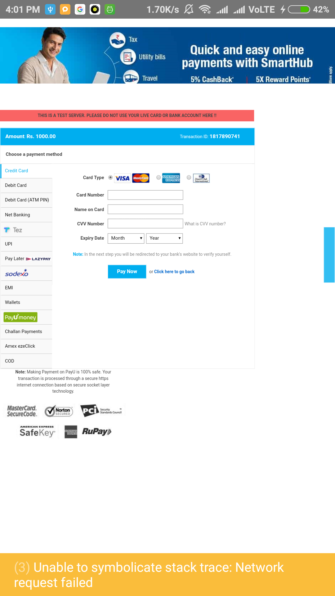

# PayUBiz Payment Gateway

Implemented PayUBiz payment gateway using React Native's webview and SDK.
Used `sha512` for encryption of data and sending it.

Packages Used:
* `js-sha512` for encrypting data into SHA512
* `payu-non-seam-less-react` React Native SDK for seamless integration

<b>Note: If you are using PayU's react native SDK, then link it with android and iOS before proceeding.</b>

Note: Sandbox URL is used here to post the data.

## Screen:

